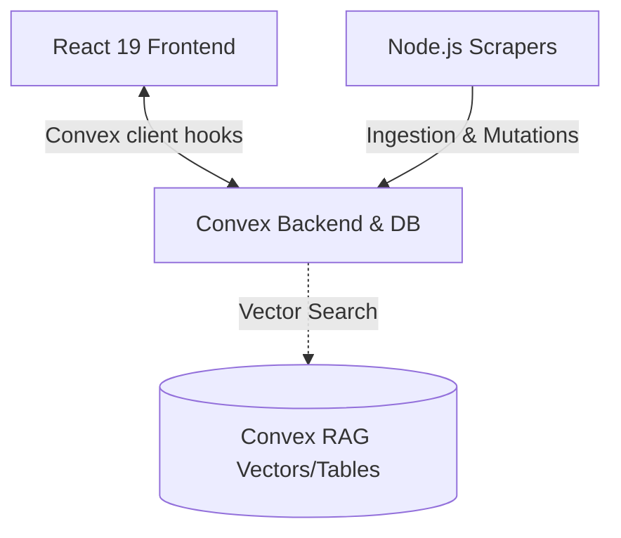

# Project Overview
Clarus is an AI-powered web application utilizing a modern serverless stack. It features a robust frontend built with React 19 and TanStack Router, paired directly with Convex as the primary backend and database layer. Additionally, a set of RAG-oriented web scrapers handles content ingestion into Convex.

## Repository Structure
- `frontend/` - Modern React application serving as the primary user interface.
  - `convex/` - Convex database schema, backend functions, and vector search logic.
  - `src/` - React components, hooks, TanStack routing, and application logic.
- `scrapers/` - Node 18+ web scrapers for fetching and preparing RAG content.
  - `src/` - TypeScript instructions for scraping and Convex ingestion scripts.
- `docs/` - Documentation and prompt guidelines.
- `docker-compose.yml` - > TODO: outdated or legacy configuration (references a non-existent `backend` directory).

## Tech stack
- **Frontend Framework**: React 19, Vite (bundling), TanStack Router (file-based routing).
- **Styling**: TailwindCSS, integrating Typography and Prettier plugins.
- **Backend & Database**: Convex (handles DB schema, real-time sync, and vector embeddings).
- **Scrapers**: Node.js 18+, TypeScript, JSDOM, Mozilla Readability.
- **AI & Integrations**: `@ai-sdk` (Google/OpenAI models), Clerk (Authentication), Tolgee (i18n).
- **Package Manager**: npm.

## Database Schema
The primary schema is defined in `frontend/convex/schema.ts` and managed by Convex:
- `guidedSessions`: Tracks user sessions, workflow steps, given answers, active tasks, and completion statuses. Indexed by `user_id` and `created_at`.
- `chatMessages`: Captures conversational AI dialog (`role`, `content`, `created_at`).
- `actionUsageEvents`: Auditing system for tracking user actions.
- `ragChunks`: Stores ingested document chunks for RAG. Includes metadata (`site_id`, `url`, `chunk_text`, `lang`), hashes, and an `embedding` vector (1536 dimensions). Equipped with a vector index for semantic search.

## Build & Development Commands
**Frontend (`frontend/`)**
```bash
npm run dev
npm run dev:convex
npm run build
npm run lint
npm run format
npm run generate-routes
npm run typecheck
```

**Scrapers (`scrapers/`)**
```bash
npm run scrape
npm run scrape:migrationsverket
npm run ingest:convex
npm run typecheck
```

## Code Style, Quality and Conventions
- **Code Formatting**: Prettier (`npm run format`) with automatic import sorting.
- **Linting**: ESLint (`npm run lint`), strictly enforcing no warnings on TS/TSX.
- **Typing**: Strict TypeScript (`tsc --noEmit`).
- **Conventions**: File-based routing via `@tanstack/react-router`. Convex is the direct data layer used directly from React components.
- **Commit Messages**: > TODO: specify commit conventions.

## Architecture Notes

There is no traditional REST backend directory in this repository. Convex serves as the exclusive backend and database layer. The frontend communicates seamlessly with Convex via its secure client hooks. Separately, the `scrapers/` directory periodically fetches and chunks external content, creating embeddings and directly ingesting them into the Convex database to power the frontend's RAG capabilities. 

## Development Tools
- [Context7](https://github.com/upstash/context) - Development context tool.
